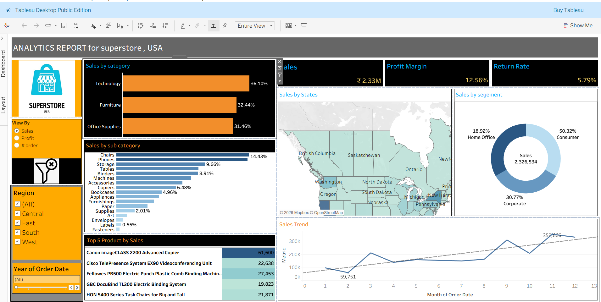

# 📊 Superstore Sales Analytics Dashboard | Tableau Project

## 📌 Project Overview
This project is an interactive **Business Intelligence Dashboard** developed using **Tableau** to analyze and visualize Superstore sales data across the USA. The dashboard transforms raw business data into meaningful insights using advanced visualizations, KPI tracking, filters, and trend analysis.

The project focuses on helping businesses monitor sales performance, profit margins, customer segments, return rates, and regional sales trends for better decision-making.

---

# 🚀 Business Problem
Businesses generate large amounts of sales data every day, making it difficult to manually identify trends, top-performing products, profitable regions, and customer behavior.

This Tableau dashboard solves the problem by:
- Providing a centralized analytics dashboard
- Tracking important KPIs in real time
- Identifying high-performing categories and products
- Monitoring sales trends and return rates
- Supporting data-driven business decisions

---

# 🛠️ Tools & Technologies Used
- **Tableau Desktop Public Edition**
- **Excel / CSV Dataset**
- **Data Visualization**
- **Business Intelligence**
- **Dashboard Designing**
- **Data Analytics**

---

# 📊 Dashboard Features

## ✅ KPI Cards
- Total Sales
- Profit Margin
- Return Rate

## ✅ Interactive Filters
- Region Filter
- Year Filter
- Dynamic View Selection

## ✅ Visualizations Included
- Sales by Category
- Sales by Sub-Category
- Sales by State (Map Visualization)
- Sales by Segment (Donut Chart)
- Monthly Sales Trend
- Top 5 Products by Sales

---

# 📈 Key Business Insights

### 🔹 Category Analysis
- Technology category contributes the highest sales
- Furniture and Office Supplies also show strong performance

### 🔹 Regional Analysis
- Dashboard helps compare sales across different US states
- Enables identification of high-performing regions

### 🔹 Customer Segment Analysis
- Consumer segment contributes the highest share of sales
- Corporate and Home Office segments also generate significant revenue

### 🔹 Product Performance
- Top-performing products are highlighted based on sales
- Helps businesses identify best-selling items

### 🔹 Trend Analysis
- Monthly sales trend visualization helps track business growth patterns
- Useful for forecasting and seasonal analysis

---

# 🧩 Dashboard Workflow

1. Data Collection  
2. Data Cleaning & Preparation  
3. Data Import into Tableau  
4. KPI Calculation  
5. Chart & Visualization Creation  
6. Interactive Dashboard Development  
7. Business Insight Generation  

---

# 🎯 Skills Demonstrated
- Tableau Dashboard Development
- Data Visualization
- Business Intelligence Reporting
- KPI Monitoring
- Interactive Dashboard Designing
- Data Storytelling
- Analytical Thinking

---

# 📷 Dashboard Preview

---

# 📌 Business Use Case
This dashboard can be used by:
- Business Analysts
- Sales Teams
- Management Teams
- Data Analysts
- Decision Makers

to monitor business performance and make strategic decisions using visual analytics.

---

# 🔥 Future Enhancements
- Real-time data integration
- Predictive analytics
- Advanced KPI metrics
- Automated reporting
- Customer behavior analysis

# ⭐ Conclusion
This project demonstrates the practical implementation of Tableau for building professional business dashboards. It showcases the ability to transform raw sales data into actionable insights through interactive visualizations and business intelligence techniques.
